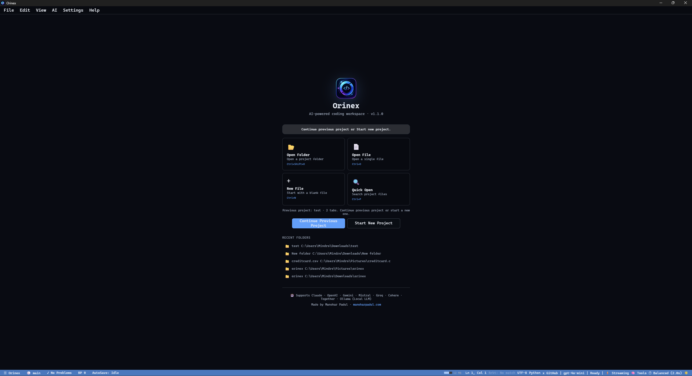
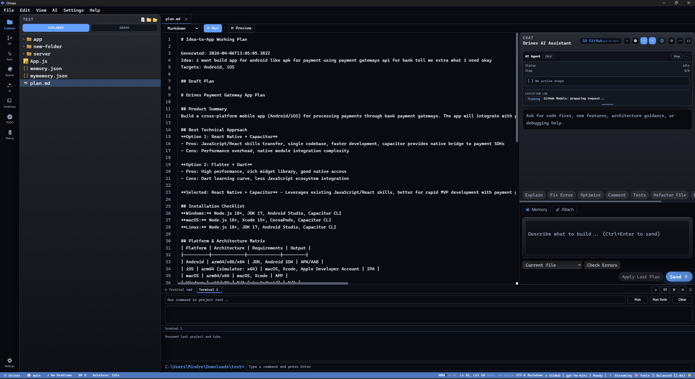
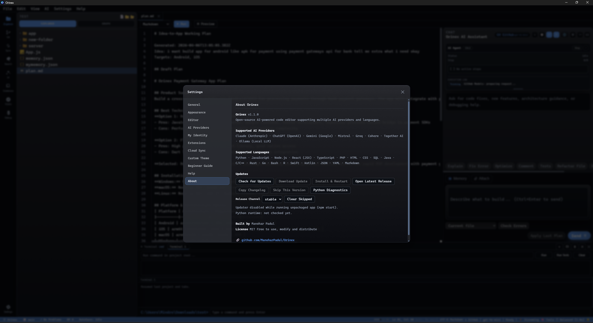

<h1 align="center">⚡Orinex</h1>

  

### AI-Native Developer Workspace — Built for Intelligent Coding

**[⬇️ Download](#-downloads) · [✨ Features](#-features) · [🧠 AI System](#-ai-system) · [🔑 Setup](#-ai-provider-setup)**

Built by **Manohar Padul**

---

## 🌟 What is Orinex?

Orinex is a next-generation AI-native development environment combining:
- Multi-model AI orchestration  
- Persistent developer memory  
- Full-featured IDE capabilities  

---

## 🧠 AI System

### 🤖 Multi-Provider AI Engine
- OpenAI, Claude, Gemini, Mistral, Groq, Cohere, Together, GitHub Models, Ollama  
- Smart failover system  
- AI self-test system  

### ⚡ AI Coding Workflow
- Inline AI (fix, refactor, explain)  
- AI autocomplete  
- AI code review on save  
- Chat with full codebase  

### 🧠 Memory Engine
- Developer profile tracking  
- Context injection  
- Memory versioning  

---

## ✨ Features

- Monaco Editor (VS Code engine)  
- Split editor  
- Terminal + Git integration  
- Command palette  
- Snippet system  
- Pomodoro timer  

---

## 🖼️ Screenshots

---

## 📦 Downloads

- Windows: Orinex-1.1.0-Windows-x64.exe  
- macOS: Orinex-1.1.0-macOS-universal.dmg  
- Linux: AppImage / .deb / .tar.gz  

---

## ⚙️ Tech Stack

- Electron  
- Node.js  
- JavaScript  
- AI APIs  

---

## 👤 Author

Manohar Padul  
https://github.com/ManoharPadul
