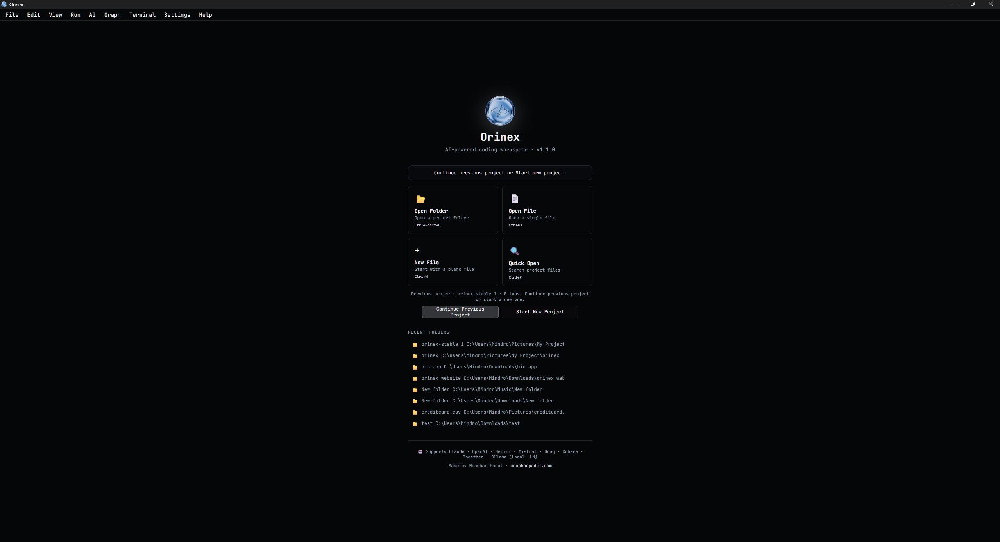
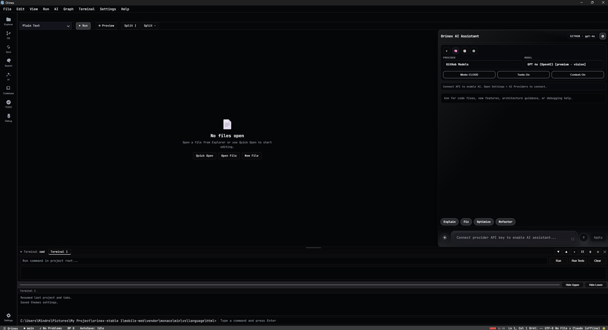
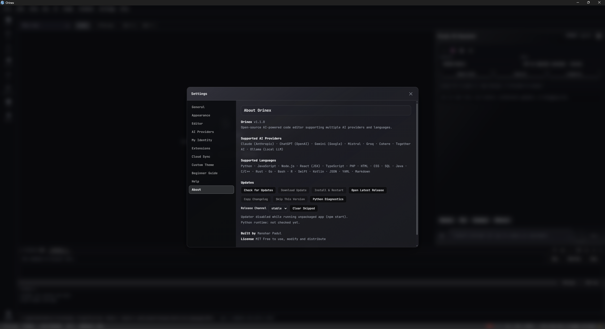

# ⚡ Orinex

> **AI-native development platform for real-world engineering workflows**

Fast. Intelligent. Fully integrated.

---

[](https://github.com/ManoharPadul/Orinex/actions)
[](https://github.com/ManoharPadul/Orinex/actions)


---

<p align="center">
  
</p>

<p align="center">
  Built by <strong>Manohar Padul</strong><br/>
  https://manoharpadul.com
</p>

---

# 🚀 Overview

Orinex is not just a code editor — it’s a **complete AI-native development system** designed for real projects.

```text
✔ Multi-provider AI orchestration
✔ Graph-based code intelligence
✔ Runtime-aware development workflows
✔ Persistent memory system
✔ Cross-platform desktop performance
```

---

# 🌟 Why Orinex?

* ⚡ Desktop-first performance (no browser lag)
* 🤖 Unified AI system (no tool fragmentation)
* 🧠 Context-aware workflows (project-level intelligence)
* 🧩 Built for real-world scale (not demos)

---

# 🆕 v1.1.0 — Production Release

This version consolidates Orinex into a **stable, production-ready platform**.

## Core Improvements

* Unified AI routing system (`AIRouter`)
* Graph system upgraded to dependency-based renderer
* Large-project performance improvements (1000+ nodes)
* Runtime Intelligence panel with rollback support
* Fully async file system (no UI blocking)
* Hardened IPC + terminal execution security
* Stable cross-platform build pipeline

---

# 🤖 AI System

## Multi-provider support

* OpenAI, Claude, Gemini
* Mistral, Groq, Cohere, Together
* GitHub Models
* Ollama (local AI)

## Capabilities

* Inline AI (fix, refactor, explain)
* AI autocomplete (Copilot-style)
* Codebase chat (RAG-powered)
* AI code review (on save)
* Test & documentation generation
* Smart provider failover
* One-click AI diagnostics

---

# 🧠 Memory & Runtime Intelligence

* Persistent chat + context memory
* Context-aware prompt injection
* Runtime Intelligence panel
* Snapshot + rollback system

---

# 🧩 Graph Intelligence

* Dependency Graph
* Function Graph (unified)

```text
✔ Organic clustering (no layout instability)
✔ Large-scale project support
✔ Theme-aware rendering
✔ 2D with safe 3D fallback
```

---

# 🛠️ Developer Tooling

* Interactive diff workspace
* Multi-file search & replace (regex)
* Integrated debugger (DAP)
* Git tools (log, diff, stash)
* Package manager UI

---

# 🖥️ Editor Features

* Split editor
* Multi-cursor editing
* Code folding + minimap
* Auto-save
* Breakpoints

---

# 📸 Screenshots





---

# 🎛️ Productivity

* Command palette
* Focus mode
* Typewriter mode
* Snippet system
* Multi-window support

---

# 🔒 Security

* API key masking
* Encrypted storage
* Terminal allowlist execution
* Production-safe IPC design

---

# 🎨 Appearance

* 17+ themes
* Glass + solid UI modes
* Custom theme builder
* Theme-aware graphs

---

# 🖥️ Platform Support

```text
✔ Windows
✔ macOS (Intel + Apple Silicon)
✔ Linux
```

---

# 📥 Download

👉 https://github.com/ManoharPadul/Orinex/releases

---

# 🔑 AI Setup

1. Open Orinex
2. Select AI provider
3. Enter API key
4. Save

---

# 📊 Status

```text
✔ Tests passing
✔ Graph system stable
✔ Runtime system validated
✔ Build pipeline verified
```

---

# 🏁 Project Direction

Orinex is evolving from:

```text
Editor + AI tools
```

to:

```text
AI-native development platform
```

---

# 🤝 Contributing

* Fork repository
* Create feature branch
* Submit PR

---

# 📄 License

MIT License

---

# ⭐ Support

If Orinex helps you:

* ⭐ Star the repo
* 🐛 Report issues
* 💡 Suggest features
